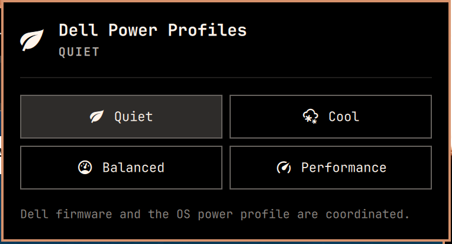

# Dell Power Profiles for Omarchy

A Dell firmware power and charging-profile integration for Omarchy, distributed as two
cleanly separated pieces:

- an Arch package that owns hardware detection, profile coordination, state,
  and udev permissions
- an optional Quattro power-panel replacement that preserves Omarchy's full
  battery UI while adding the Dell profiles



It exposes `quiet`, `cool`, `balanced`, and `performance` while coordinating
the Dell firmware controller with the OS power profile. It also reads and
changes Dell's `Adaptive`, `Standard`, `ExpressCharge`, `Primarily AC`, and
`Custom` battery-charging modes.

The provider coordinates each firmware mode with
[`power-profiles-daemon`](https://gitlab.freedesktop.org/upower/power-profiles-daemon):

| Dell firmware mode | OS power profile |
| --- | --- |
| `quiet` | `power-saver` |
| `cool` | `balanced` |
| `balanced` | `balanced` |
| `performance` | `performance` |

Only modes supported by both the Dell firmware and
`power-profiles-daemon` are shown. A mode is marked active only when both
layers agree.

## Install the backend

Clone the repository and build the Arch package:

```bash
git clone https://github.com/stappmus/omarchy-dell-power-profiles.git
cd omarchy-dell-power-profiles
makepkg --cleanbuild --install
```

The package installs:

- `/usr/lib/omarchy/powerprofiles.d/dell`, the provider used automatically by
  compatible Omarchy versions
- `/usr/bin/omarchy-dell-power-profiles`, a direct CLI symlink
- `/usr/lib/udev/rules.d/99-omarchy-dell-platform-profile.rules`, which grants
  the `wheel` group access only to the Dell power-profile and battery-charging
  attributes used by the backend
- `omarchy-dell-power-profiles-permissions.service`, a device-triggered
  one-shot service that waits for Dell's charging attributes during boot and
  applies their scoped permissions

The package hook reloads the udev rule and runs the one-shot service
immediately. The firmware device starts it again at boot, and package removal
restores the sysfs permissions it changed.

## Install the bar widget

Install the optional frontend, then replace the stock power widget so the bar
has one complete power panel instead of two partial ones:

```bash
omarchy plugin add https://github.com/stappmus/omarchy-dell-power-profiles.git --enable
omarchy plugin disable omarchy.power
```

The replacement keeps the stock battery icon, charge state, percentage,
progress, capacity, cycle count, time estimate, and charge/discharge rate. If
it is installed before the backend, the panel keeps the standard OS power
profiles available and explains what is missing. Once the backend is
installed, it discovers the Dell modes automatically.

The selected charging profile appears in one compact row. Its available modes
stay hidden until the row is opened as a dropdown. A saved custom threshold is
shown in its label, for example `Custom · 50–80%`. Selecting `Custom` reveals
separate start- and stop-percentage fields. Values outside Dell's firmware
limits are adjusted automatically (`25%` becomes `50%` on supported systems),
and the panel shows the active BIOS ranges and preserves at least a
five-percentage-point gap.

Right-click the bar widget to toggle its compact battery percentage, matching
the current built-in Omarchy power widget.

The widget restores the saved AC or battery preference when it loads and when
the power source changes. Compatible Omarchy versions can also discover the
same packaged provider from the built-in power menu.

## CLI

```bash
omarchy-dell-power-profiles probe
omarchy-dell-power-profiles list
omarchy-dell-power-profiles list --active-state
omarchy-dell-power-profiles set autodetect quiet
omarchy-dell-power-profiles set ac performance
omarchy-dell-power-profiles set battery cool
omarchy-dell-power-profiles charging probe
omarchy-dell-power-profiles charging list --active-state
omarchy-dell-power-profiles charging set adaptive
omarchy-dell-power-profiles charging set primarily-ac
omarchy-dell-power-profiles charging set custom 50 80
```

Selections are remembered independently for AC and battery operation under
`$XDG_STATE_HOME/omarchy/powerprofiles`.

## Remove

Remove the frontend and backend independently:

```bash
omarchy plugin remove stappmus.dell-power-profiles
omarchy plugin enable omarchy.power --section right
sudo pacman -Rns omarchy-dell-power-profiles
```

The package does not overwrite files in a user's home directory. Its udev rule
grants the local `wheel` group write access only to the Dell platform power
profile, primary battery-charging mode, and its custom start and stop
thresholds.

## Upstream

The panel frontend is derived from Omarchy's MIT-licensed `omarchy.power`
widget. It deliberately remains a separate plugin so Dell-specific behavior
does not need to live in Omarchy core.

## Test

```bash
./provider-test.sh
./plugin-test.sh
qmllint -I /usr/share/omarchy/shell Panel.qml
omarchy plugin validate .
makepkg --cleanbuild
```

The backend suite uses temporary fake sysfs and `powerprofilesctl`
implementations; it does not change the host's power profile.
